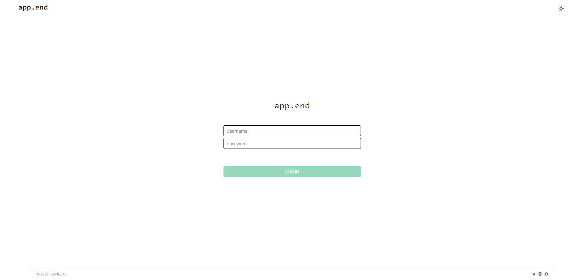
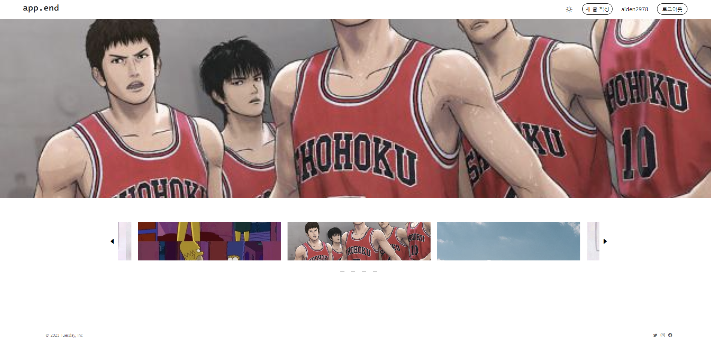
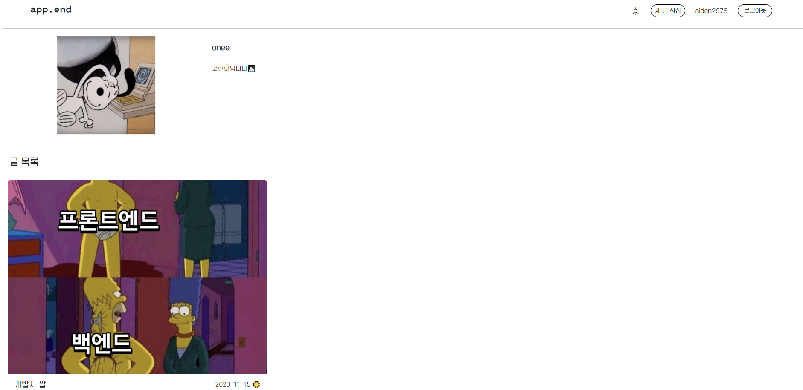
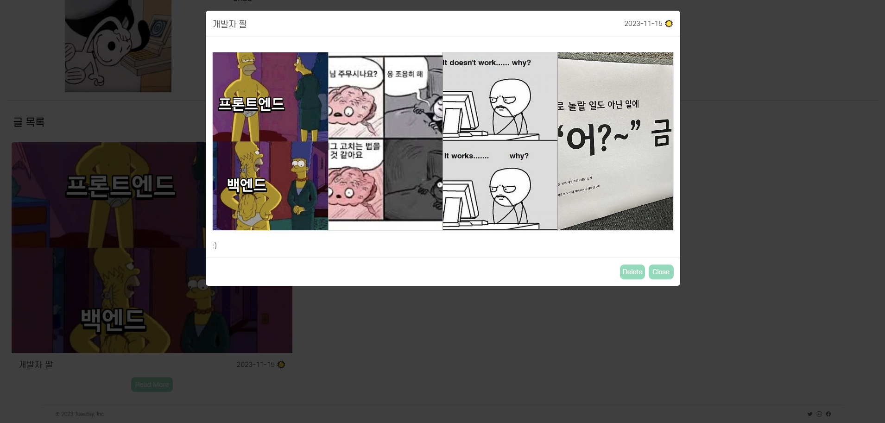
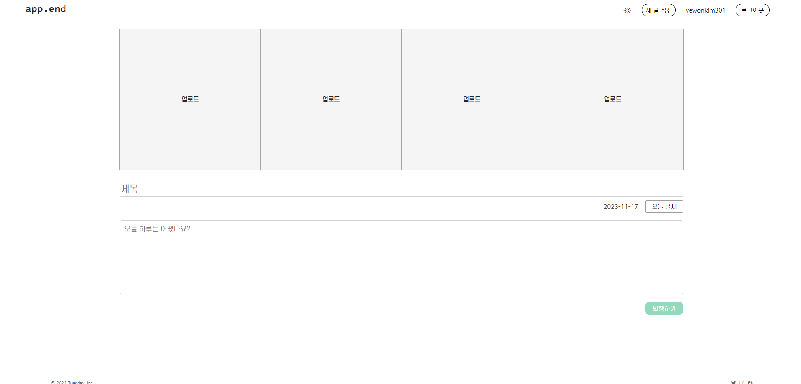

# APP.END

일상의 네컷을 담은 하루 일기 블로그

# 프로젝트 설명

포스코x코딩온 웹 풀스택 10기

프로젝트 기간 : 2023.11.10. ~ 2023.11.19.

사용 언어 : HTML, CSS, JAVASCRIPT

# 배포 주소

https://tuesday-append.netlify.app/index.html

# 프로젝트 소개

- app.end는 하루를 기록하는 컨셉의 블로그입니다.

- app.end는 다음과 같은 기능을 지원하고 있습니다.
  1. 하루를 나타내는 사진 네 장을 첨부하고 그 날의 날씨와 기분 및 있었던 일을 기록할 수 있습니다.
  2. 메인페이지에서 보여지는 이미지를 통해 다른 사람의 블로그를 구경할 수 있습니다.

# 팀원 및 참고자료

- 팀명 : tuesday
- 팀원 :

  곽찬혁 (팀장) (https://github.com/kch0830) : 로그인 페이지 구현 및 css

  김예원(https://github.com/yewonkim301) : 메인 페이지 및 헤더와 푸터 구현 및 css

  조건우(https://github.com/aiden2978) : 글 목록 페이지 구현 및 css

  한지혜(https://github.com/jihyehan91) : 새 글 작성하는 페이지 구현 및 css

# STACKS

      

# 주요 기능

- 다크모드와 라이트 모드 기능

  - 유저마다 다크모드와 라이트 모드를 설정할 수 있으며, 설정 후 모드를 유지할 수 있다.

- 새 글 작성 기능

  - 사진 4장 및 오늘 날씨와 함께 하루에 대한 기록을 작성할 수 있다.

- 글 삭제 기능

  - 유저가 자신이 작성한 글 목록에서 글을 삭제할 수 있다.

# 화면 구성

로그인 화면

- 저장된 ID와 PW를 이용하여 로그인 가능
- 클릭 뿐 아니라 enter 키를 통해 로그인 가능
- ID나 PW를 입력하지 않거나 잘못된 정보로 로그인하면 경고창 표시
- 로그인에 성공하면 ID를 localStorage에 저장하여 로그아웃시 까지 유지
- 로그인에 성공하면 header에 새 글 작성, 나의 블로그, 로그아웃 버튼 표시

 

메인 페이지 화면

- 상단에 블로그의 대표 사진이 자동 전시
- 밑의 slider-bar를 이용하여 이동 가능
- 사진을 클릭하면 해당 블로그로 이동

 

블로그 글 목록 화면

- localStorage에 저장된 프로필 중 해당 유저와 일치하는 프로필 표시
- localStorage에 저장된 글 목록 중 해당 유저가 작성한 글들만 선택하여 표시
- 제목과 내용, 대표 사진, 작성일과 날씨를 카드 형태로 표시
- Read More 버튼을 클릭하면 모달 형태로 글을 표시
- 로그인한 사용자가 블로그 작성자와 일치할 때 삭제 버튼을 표시하고, 게시글 삭제 가능

 

새 글 작성 화면

- 각각의 이미지를 업로드하여 미리보기로 볼 수 있고, 삭제도 가능
- 사진 네 장과 제목, 내용, 날씨를 작성하여 작성일, 작성자와 함께 localStorage에 저장
- 하나라도 작성하지 않으면 경고창 표시

<!--
# 구현 (방법)

### localStorage에 저장한 values

###### profileElement

    title: 블로그 제목

    content: 프로필 내용

    user: 사용자 (== userName일 때 show)

    src: 이미지 주소

###### articleElement

    title: 제목

    content: 내용

    author: 작성자 (== userName일 때 show)

    src1~4: 이미지 주소

    num: 일련번호 (Date.now()를 통해 고유한 번호 생성)

    day: 작성일자

    weather: 날씨

###### etc

    userName: 보고자 하는 블로그의 작성자

    loggedinUser: 현재 로그인한 사용자

    loginSuccess: 로그인 유무

    darkMode: 다크모드

### articles.html

mainPage에서 클릭한 사용자의 블로그를 보여주는 페이지입니다. mainPage에서 클릭한 블로그의 주인을 localStorage의 userName 키 값으로 보내고, 페이지를 로드할 때 해당 userName과 일치하는 프로필과 글 내용들을 모두 가져옵니다. 이 때 localStorage에 값들은 배열 형식으로 저장하기 때문에, JSON.stringify()와 JSON.parse() 메소드를 통해 자료형을 변환하여 사용하였습니다.

블로그의 글들은 bootstrap의 card 요소를 사용하였습니다. 게시글의 제목, 작성일, 날씨와 대표 사진 한 장의 src를 localStorage에서 받아와 표시하였습니다. 화면의 너비에 따라 mediaQuery를 이용하여 한 줄에 뜨는 게시글의 개수를 반응형으로 제어하였습니다.

글의 내용은 bootstrap의 modal 요소를 사용하여 표시하였습니다. 게시글의 제목, 내용, 작성일, 날씨, 그리고 사진 4장의 src를 localStorage에서 불러와 표시하였습니다. 화면의 너비에 따라 modal의 max-width가 달라지도록 하였으며, 또한 flex-wrap 속성을 이용하여 사진 네 장의 배치 방식을 제어하였습니다.

# mainPage.html

mainPage에서 다른 유저들의 블로그들을 보여주는 슬라이더를 통해 다른 유저들의 블로그로 방문을 할 수 있습니다.

# header.html

유저의 선호에 따라 다크모드와 라이트 모드를 선택하여 웹을 이용할 수 있습니다.
버튼을 클릭했을 때, dark-mode 클래스를 toggle하여 다크모드의 css가 적용될 수 있도록 하였습니다. 그리고 로컬스토리지에 다크모드 상태의 유무를 저장해 새로고침 후에도 유저의 설정을 계속 유지할 수 있도록 하였습니다. 유저의 디바이스 화면의 크기에 따라 반응형이 적용될 수 있도록 하였습니다. 일정 사이즈 이상의 화면에서는 목록 버튼에 css 속성을 display: none으로 주었다가 화면의 사이즈가 작아졌을 때 목록 버튼이 보이도록 제어했습니다. 또한 미디어쿼리를 이용해 일정 사이즈 이하의 화면에서는 헤더의 버튼들에 flex-direction: column 속성을 주어 버튼들이 드롭다운 형태로 보일 수 있도록 했습니다.

### login.html

각 조원의 아이디 4개를 입력받아 로그인 가능한 페이지 제작하였습니다.
performLogin() 함수를 선언하여, 각각의 입력받은 값이 전역 변수 const VALID_LOGIN_IDS, const LOGIN_PW 값과 일치하였을 때, location.href를 이용해 페이지 메인 페이지로 이동 하도록 제작하였습니다.
또한,  localStorage를 사용하여, 브라우저에 key-value 값을 storage에 저장하고, 이를 이용하여 로그인 후에도 데이터가 유지되며, 각 LOGIN_IDS의 블로그의 주인 페이지로 이동 가능합니다.

추가로 LOGIN_IDS 혹은 LOGIN_PW 값과 일치하지 않는 값을 입력받았을 때, wrongAlert(), noInputAlert() 함수를 제작하여, alert 메세지를 띄울 수 있도록 제작하였습니다.

addEventListener를 이용해 enter 키를 활용한 이벤트를 제작하여, 로그인 버튼 클릭 뿐 아니라, key-code 13인 enter 키가 누름이 해제될 때 로그인 버튼이 실행 되도록 제작하였습니다.
-->
